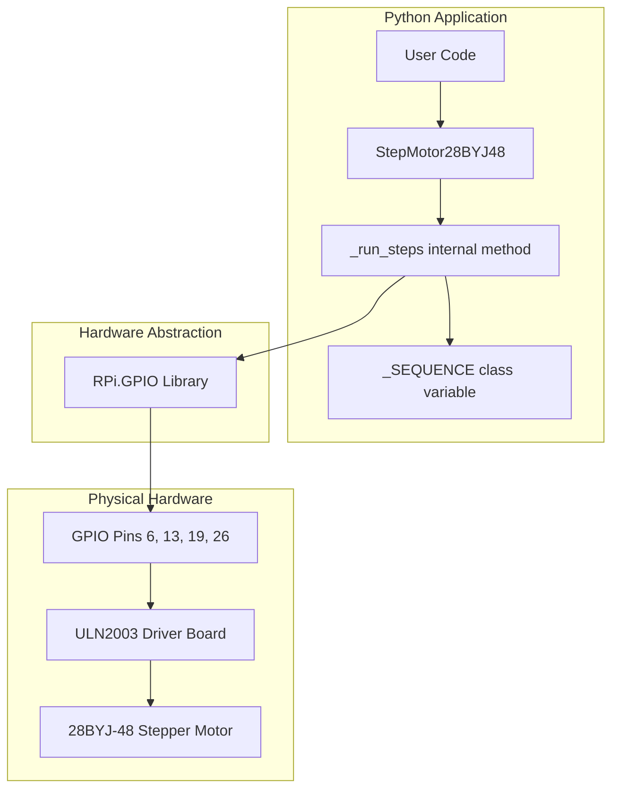
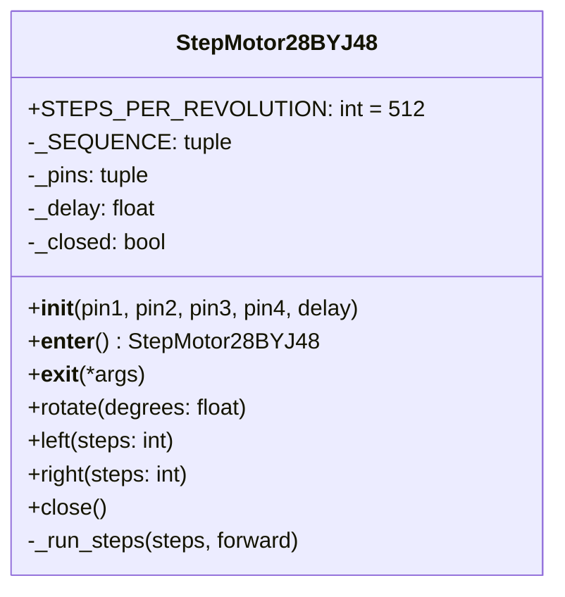
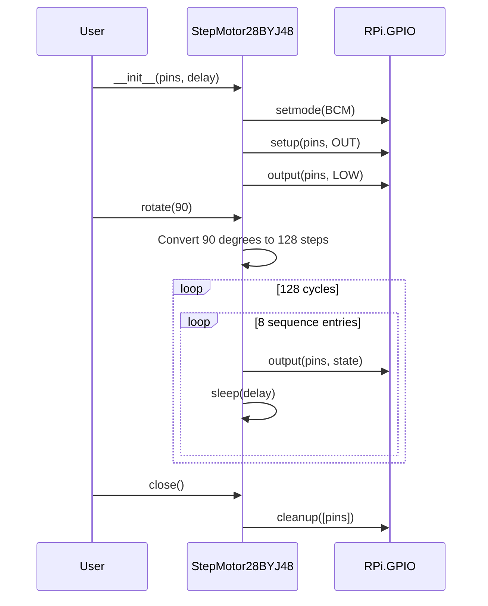

# Architecture

<!-- metadata:type=architecture, audience=ai-agents, scope=system-design -->

## Overview

Single-class architecture encapsulating all motor state and control logic. No module-level side effects — GPIO is initialized only when a `StepMotor28BYJ48` instance is created.

## Architectural Pattern

**Pattern:** Object-oriented hardware driver with context manager protocol

The class encapsulates GPIO state, provides a clean lifecycle (init → use → close), and supports Python's `with` statement for automatic resource cleanup.

## System Architecture

## Class Design

## Execution Flow

## Design Decisions

| Decision | Rationale |
|----------|-----------|
| Class-based (not procedural) | Encapsulates state, supports multiple motors, enables context manager |
| Data-driven step sequence | Single tuple table + loop replaces 8 separate functions |
| Per-pin GPIO cleanup | `GPIO.cleanup([pins])` avoids interfering with other GPIO users |
| `_closed` flag | Prevents use-after-close bugs with clear `RuntimeError` |
| No print statements | Clean library behavior; users add their own logging |
| Configurable pins | Supports non-default wiring and multiple motors |

## Constraints

- **RPi.GPIO import at module level:** Importing `motor.py` requires RPi.GPIO to be available (or mocked)
- **Blocking execution:** `left()`, `right()`, and `rotate()` block until all steps complete
- **Single-threaded:** No thread safety; concurrent calls from multiple threads are unsafe
- **No async support:** Blocking `sleep()` calls; not compatible with asyncio event loops
