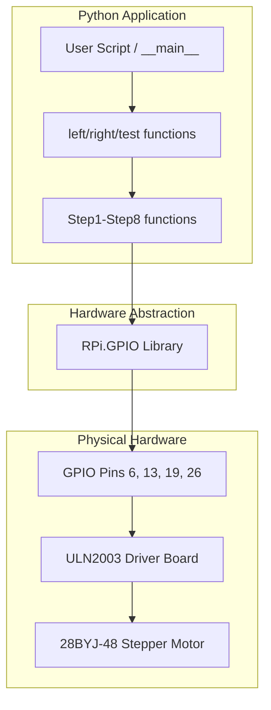
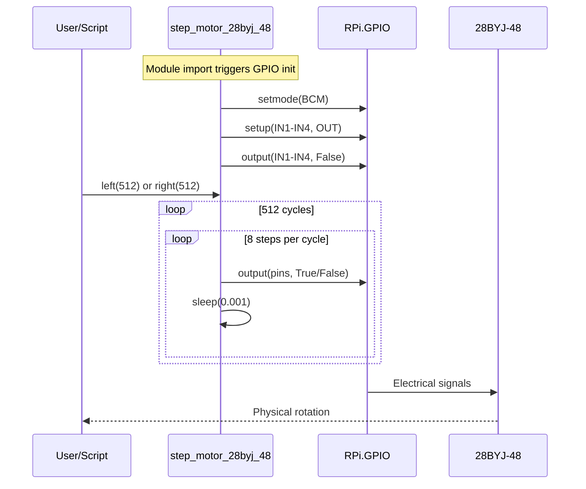

# Architecture

<!-- metadata:type=architecture, audience=ai-agents, scope=system-design -->

## Overview

The project follows a flat, procedural architecture with no class hierarchy. A single module handles all motor control logic through module-level state and standalone functions.

## Architectural Pattern

**Pattern:** Procedural scripting with module-level initialization

The module initializes GPIO hardware at import time (module-level side effects), then exposes functions for motor control. This is a common pattern for simple Raspberry Pi hardware drivers.

## System Architecture

## Execution Flow

## Design Decisions

| Decision | Rationale |
|----------|-----------|
| Module-level GPIO init | Simple usage — import and call. No setup ceremony needed |
| Half-step sequence | Smoother rotation and higher resolution than full-step |
| Hardcoded pins | Single-purpose driver for a specific wiring configuration |
| No class abstraction | Minimal complexity for a single-motor use case |
| `time = 0.001` global | Simple speed control via module-level variable |

## Constraints

- **Single motor only:** Pin assignments are hardcoded; cannot drive multiple motors simultaneously
- **Import side effects:** Importing the module immediately configures GPIO, which fails on non-Pi hardware
- **No error handling:** No validation of step counts, no GPIO error recovery
- **Blocking execution:** `left()` and `right()` block until all steps complete
