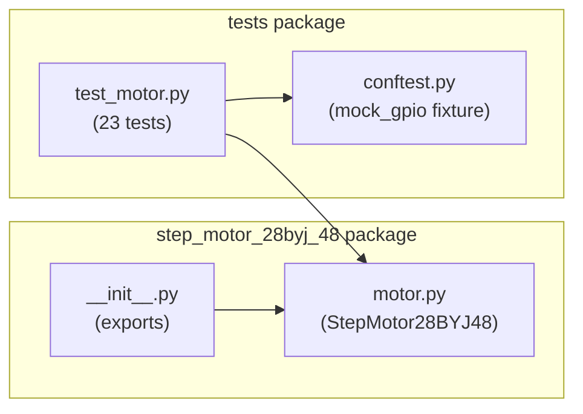

# Components

<!-- metadata:type=components, audience=ai-agents, scope=module-level -->

## Component Map

## Module: motor.py

The sole implementation module. Contains the `StepMotor28BYJ48` class.

### Class Variables

| Name | Type | Value | Purpose |
|------|------|-------|---------|
| `_SEQUENCE` | `tuple[tuple[int, ...], ...]` | 8 half-step states | Defines coil activation pattern |
| `STEPS_PER_REVOLUTION` | `int` | 512 | Full rotation step count |

### Instance Attributes

| Name | Type | Set In | Purpose |
|------|------|--------|---------|
| `_pins` | `tuple[int, int, int, int]` | `__init__` | GPIO BCM pin numbers |
| `_delay` | `float` | `__init__` | Seconds between steps |
| `_closed` | `bool` | `__init__` | Lifecycle flag |

### Methods

| Method | Visibility | Purpose |
|--------|-----------|---------|
| `__init__` | Public | Configure pins, validate delay, initialize GPIO |
| `__enter__` | Public | Context manager entry (returns self) |
| `__exit__` | Public | Context manager exit (calls close) |
| `_run_steps` | Private | Core step execution loop |
| `left` | Public | Rotate counter-clockwise by step cycles |
| `right` | Public | Rotate clockwise by step cycles |
| `rotate` | Public | Rotate by degrees (positive=CW, negative=CCW) |
| `close` | Public | Release GPIO resources (idempotent) |

### Half-Step Sequence Table

| Step | IN1 (pin1) | IN2 (pin2) | IN3 (pin3) | IN4 (pin4) |
|------|-----------|-----------|-----------|-----------|
| 0 | 0 | 0 | 0 | 1 |
| 1 | 0 | 0 | 1 | 1 |
| 2 | 0 | 0 | 1 | 0 |
| 3 | 0 | 1 | 1 | 0 |
| 4 | 0 | 1 | 0 | 0 |
| 5 | 1 | 1 | 0 | 0 |
| 6 | 1 | 0 | 0 | 0 |
| 7 | 1 | 0 | 0 | 1 |

### Rotation Math

- 8 half-steps = 1 step cycle
- 512 step cycles = 360 degrees
- Conversion: `steps = round(abs(degrees) / 360 * 512)`

### Direction Logic

- **Counter-clockwise (left):** Sequence iterated forward (index 0 to 7)
- **Clockwise (right):** Sequence iterated reversed (index 7 to 0)
- **rotate(degrees):** Positive = clockwise, negative = counter-clockwise

## Module: __init__.py

Exports `StepMotor28BYJ48` and `__version__`. No side effects.

## Test Suite

### conftest.py

Provides `mock_gpio` autouse fixture that patches `sys.modules` with a `MagicMock` for `RPi` and `RPi.GPIO`, enabling tests to run on any platform.

### test_motor.py

4 test classes covering all functionality:

| Class | Tests | Covers |
|-------|-------|--------|
| `TestInit` | 6 | GPIO setup, pin config, delay validation |
| `TestRotation` | 7 | left/right sequence, step counts, validation |
| `TestRotateDegrees` | 5 | Degree conversion, direction, zero handling |
| `TestCleanup` | 5 | close(), context manager, use-after-close |
