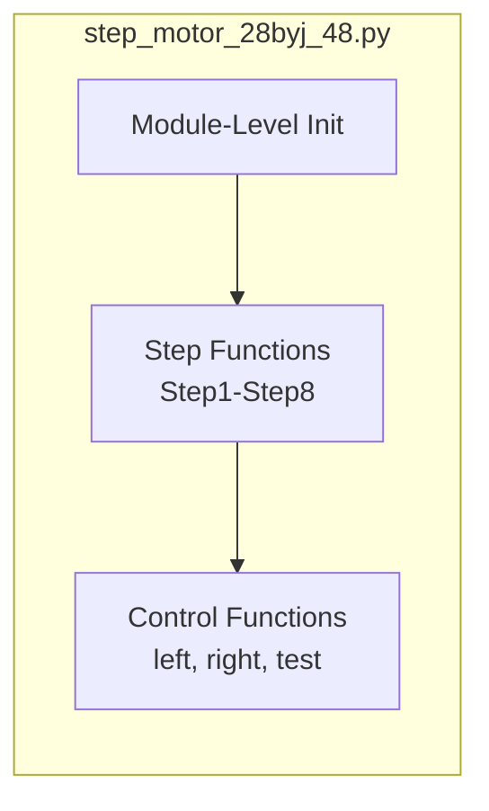

# Components

<!-- metadata:type=components, audience=ai-agents, scope=module-level -->

## Component Map

## Module: step_motor_28byj_48.py

The sole implementation module. Contains all motor control logic.

### Module-Level Initialization

Executes on import:
1. Sets GPIO mode to BCM
2. Defines pin constants (IN1=6, IN2=13, IN3=19, IN4=26)
3. Sets speed delay (`time = 0.001` seconds)
4. Configures all 4 pins as OUTPUT
5. Sets all pins to LOW (False)

### Step Functions (Step1–Step8)

Implement the half-step drive sequence. Each function:
1. Sets one or two coil pins HIGH
2. Sleeps for `time` seconds (0.001s)
3. Sets those pins back to LOW

**Half-Step Sequence Table:**

| Function | IN1 (6) | IN2 (13) | IN3 (19) | IN4 (26) |
|----------|---------|----------|----------|----------|
| Step1 | - | - | - | HIGH |
| Step2 | - | - | HIGH | HIGH |
| Step3 | - | - | HIGH | - |
| Step4 | - | HIGH | HIGH | - |
| Step5 | - | HIGH | - | - |
| Step6 | HIGH | HIGH | - | - |
| Step7 | HIGH | - | - | - |
| Step8 | HIGH | - | - | HIGH |

### Control Functions

| Function | Signature | Description |
|----------|-----------|-------------|
| `left(step)` | `left(step: int)` | Rotates motor counter-clockwise. Calls Step1→Step8 in sequence, repeated `step` times. Prints progress. |
| `right(step)` | `right(step: int)` | Rotates motor clockwise. Calls Step8→Step1 in sequence, repeated `step` times. Prints progress. |
| `test(move_right=512, move_left=512)` | `test(move_right, move_left)` | Demo function: rotates 360° right, then 360° left, then calls `GPIO.cleanup()`. |

### Key Constants

| Name | Value | Purpose |
|------|-------|---------|
| `IN1` | 6 | GPIO BCM pin for ULN2003 IN1 |
| `IN2` | 13 | GPIO BCM pin for ULN2003 IN2 |
| `IN3` | 19 | GPIO BCM pin for ULN2003 IN3 |
| `IN4` | 26 | GPIO BCM pin for ULN2003 IN4 |
| `time` | 0.001 | Delay between steps in seconds |

### Rotation Math

- 8 half-steps = 1 step cycle
- 512 step cycles = 360° rotation
- 256 step cycles = 180°
- 128 step cycles = 90°

## Package: tests/

Contains `TestStep_motor_28byj_48` — a placeholder unittest class with empty `setUp`, `tearDown`, and one empty test method (`test_000_something`).

## Package: docs/

Sphinx documentation configuration. Uses `autodoc` and `viewcode` extensions with the `alabaster` theme.
