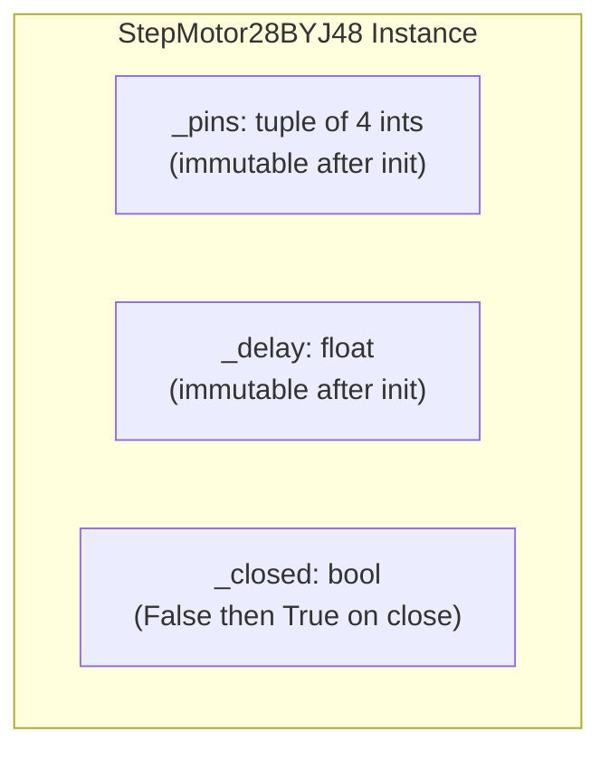
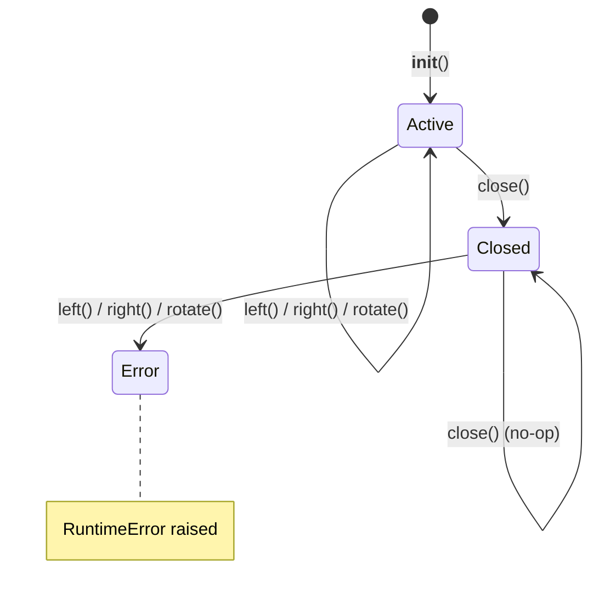

# Data Models

<!-- metadata:type=data-models, audience=ai-agents, scope=state -->

## Overview

All state is encapsulated within `StepMotor28BYJ48` instances. No global or module-level mutable state.

## Instance State



| Attribute | Type | Mutable | Lifecycle |
|-----------|------|---------|-----------|
| `_pins` | `tuple[int, int, int, int]` | No | Set in `__init__`, never changes |
| `_delay` | `float` | No | Set in `__init__`, never changes |
| `_closed` | `bool` | Yes | `False` to `True` (one-way transition via `close()`) |

## Class-Level Data

### `_SEQUENCE` — Half-Step Pattern

```python
_SEQUENCE: ClassVar[tuple[tuple[int, ...], ...]] = (
    (0, 0, 0, 1),  # Step 0: IN4 only
    (0, 0, 1, 1),  # Step 1: IN3 + IN4
    (0, 0, 1, 0),  # Step 2: IN3 only
    (0, 1, 1, 0),  # Step 3: IN2 + IN3
    (0, 1, 0, 0),  # Step 4: IN2 only
    (1, 1, 0, 0),  # Step 5: IN1 + IN2
    (1, 0, 0, 0),  # Step 6: IN1 only
    (1, 0, 0, 1),  # Step 7: IN1 + IN4
)
```

Each inner tuple maps positionally to `(pin1, pin2, pin3, pin4)`.

### `STEPS_PER_REVOLUTION`

`512` — number of full step cycles for one 360 degree rotation.

## State Transitions



## No Persistent Storage

The project does not use databases, configuration files, file I/O, or serialization.
