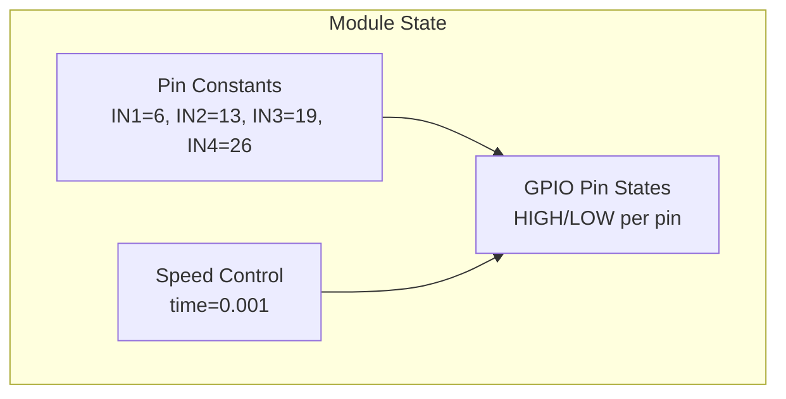
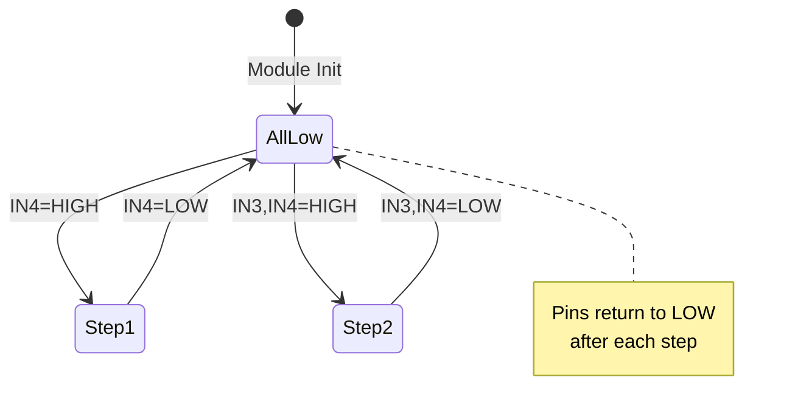

# Data Models

<!-- metadata:type=data-models, audience=ai-agents, scope=state -->

## Overview

This project has no formal data models, classes, or data structures. All state is held in module-level variables.

## Module-Level State



| Variable | Type | Mutable | Description |
|----------|------|---------|-------------|
| `IN1` | int | No (by convention) | GPIO BCM pin 6 |
| `IN2` | int | No (by convention) | GPIO BCM pin 13 |
| `IN3` | int | No (by convention) | GPIO BCM pin 19 |
| `IN4` | int | No (by convention) | GPIO BCM pin 26 |
| `time` | float | Yes | Step delay in seconds (controls speed) |

## Implicit Data: Half-Step Sequence

The step sequence is encoded implicitly in the Step1–Step8 function bodies rather than as an explicit data structure. If refactored, it could be represented as:

```python
# Equivalent data representation of the half-step sequence
HALF_STEP_SEQUENCE = [
    (0, 0, 0, 1),  # Step1: IN4
    (0, 0, 1, 1),  # Step2: IN3 + IN4
    (0, 0, 1, 0),  # Step3: IN3
    (0, 1, 1, 0),  # Step4: IN2 + IN3
    (0, 1, 0, 0),  # Step5: IN2
    (1, 1, 0, 0),  # Step6: IN1 + IN2
    (1, 0, 0, 0),  # Step7: IN1
    (1, 0, 0, 1),  # Step8: IN1 + IN4
]
```

## GPIO State Transitions

Each step function transitions the GPIO pins through a specific pattern:



## No Persistent Storage

The project does not use:
- Databases
- Configuration files (beyond setup.cfg for build tools)
- File I/O for state
- Serialization/deserialization
