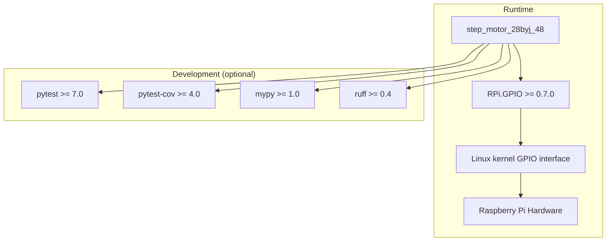

# Dependencies

<!-- metadata:type=dependencies, audience=ai-agents, scope=external -->

## Runtime Dependencies

| Package | Version | Purpose | Declared In |
|---------|---------|---------|-------------|
| RPi.GPIO | >= 0.7.0 | Raspberry Pi GPIO pin control | pyproject.toml [project.dependencies] |

## Dependency Graph

## Development Dependencies

Declared in `pyproject.toml` under `[project.optional-dependencies] dev`:

| Package | Version | Purpose |
|---------|---------|---------|
| pytest | >= 7.0 | Test runner |
| pytest-cov | >= 4.0 | Coverage reporting |
| mypy | >= 1.0 | Static type checking |
| ruff | >= 0.4 | Linting and formatting |

Install with: `pip install -e ".[dev]"`

## Platform Requirements

| Requirement | Details |
|-------------|---------|
| OS | Raspberry Pi OS / Linux with GPIO support |
| Hardware | Raspberry Pi with GPIO header |
| Python | >= 3.9 |
| Permissions | Root or gpio group membership for GPIO access |

## Testing Without Hardware

Tests mock `RPi.GPIO` via `unittest.mock`, so the test suite runs on any platform. See `tests/conftest.py` for the mocking pattern that patches `sys.modules` before the motor module is imported.
