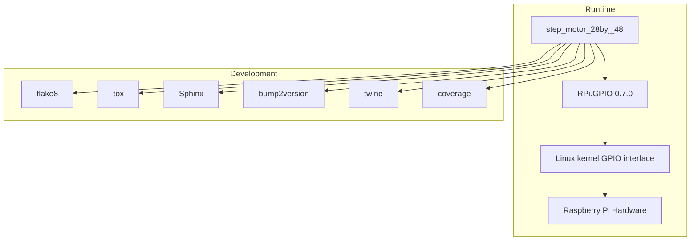

# Dependencies

<!-- metadata:type=dependencies, audience=ai-agents, scope=external -->

## Runtime Dependencies

| Package | Version | Purpose |
|---------|---------|---------|
| RPi.GPIO | 0.7.0 (pinned) | Raspberry Pi GPIO pin control |

**Note:** RPi.GPIO is listed in `requirements.txt` but not in `setup.py`'s `install_requires` (which is empty). This means `pip install step_motor_28byj_48` will not automatically install RPi.GPIO.

## Dependency Graph

## Development Dependencies

These are not declared in a single requirements-dev.txt but are implied by the Makefile and tox.ini:

| Tool | Purpose | Used In |
|------|---------|---------|
| flake8 | Linting | `make lint`, tox |
| tox | Multi-env testing | `make test-all` |
| Sphinx | Documentation generation | `make docs` |
| bump2version | Version management | Release workflow |
| twine | PyPI upload | `make release` |
| coverage | Code coverage | `make coverage` |
| watchdog (watchmedo) | Doc auto-rebuild | `make servedocs` |

## Python Version Support

Declared in `setup.py` classifiers and `tox.ini`:

- Python 2.7
- Python 3.5
- Python 3.6
- Python 3.7
- Python 3.8

## Platform Requirements

| Requirement | Details |
|-------------|---------|
| OS | Raspbian / Raspberry Pi OS (Linux) |
| Hardware | Raspberry Pi with 40-pin GPIO header |
| Permissions | Root or gpio group membership for GPIO access |

## Known Dependency Issues

1. **Missing install_requires:** `setup.py` has `requirements = []` — RPi.GPIO won't be installed automatically when the package is installed via pip
2. **Platform lock-in:** RPi.GPIO only works on Raspberry Pi hardware; no mock/stub for development on other platforms
3. **No dev requirements file:** Development dependencies are scattered across Makefile, tox.ini, and docs/conf.py
