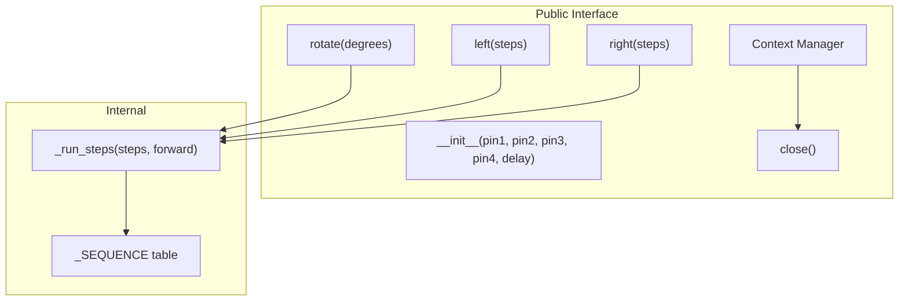
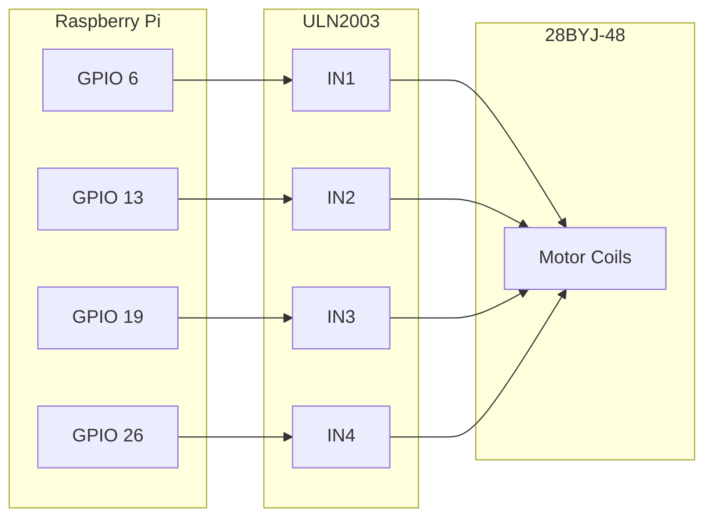

# Interfaces

<!-- metadata:type=interfaces, audience=ai-agents, scope=api -->

## Public API



## Constructor

### `StepMotor28BYJ48(pin1=6, pin2=13, pin3=19, pin4=26, delay=0.001)`

Creates a motor controller and initializes GPIO.

| Parameter | Type | Default | Description |
|-----------|------|---------|-------------|
| `pin1` | `int` | 6 | GPIO BCM pin for ULN2003 IN1 |
| `pin2` | `int` | 13 | GPIO BCM pin for ULN2003 IN2 |
| `pin3` | `int` | 19 | GPIO BCM pin for ULN2003 IN3 |
| `pin4` | `int` | 26 | GPIO BCM pin for ULN2003 IN4 |
| `delay` | `float` | 0.001 | Seconds between steps (controls speed) |

**Raises:** `ValueError` if `delay <= 0`

**Side effects:** Calls `GPIO.setmode(BCM)`, `GPIO.setup()`, `GPIO.output()` for all pins.

## Methods

### `rotate(degrees: float) -> None`

Rotate motor by angle. Positive = clockwise, negative = counter-clockwise. Zero is a no-op.

**Raises:** `RuntimeError` if motor is closed

### `left(steps: int) -> None`

Rotate counter-clockwise by step cycles (512 = 360 degrees).

**Raises:** `ValueError` if `steps <= 0`, `RuntimeError` if motor is closed

### `right(steps: int) -> None`

Rotate clockwise by step cycles (512 = 360 degrees).

**Raises:** `ValueError` if `steps <= 0`, `RuntimeError` if motor is closed

### `close() -> None`

Release GPIO resources. Safe to call multiple times (idempotent).

**Side effects:** Calls `GPIO.cleanup([pins])`

## Context Manager Protocol

```python
with StepMotor28BYJ48() as motor:
    motor.rotate(360)
# GPIO automatically cleaned up here
```

## Hardware Interface



## Usage Examples

```python
from step_motor_28byj_48 import StepMotor28BYJ48

# Basic usage with context manager
with StepMotor28BYJ48() as motor:
    motor.rotate(360)     # Full clockwise rotation
    motor.rotate(-90)     # Quarter counter-clockwise
    motor.left(128)       # 90 degrees CCW by step cycles
    motor.right(256)      # 180 degrees CW by step cycles

# Custom pins and speed
motor = StepMotor28BYJ48(pin1=17, pin2=27, pin3=22, pin4=23, delay=0.002)
motor.rotate(180)
motor.close()
```

## Error Handling

| Error | Condition | Raised By |
|-------|-----------|-----------|
| `ValueError("delay must be positive")` | `delay <= 0` | `__init__` |
| `ValueError("steps must be positive")` | `steps <= 0` | `left`, `right` |
| `RuntimeError("Motor is closed")` | Method called after `close()` | `left`, `right`, `rotate` |
