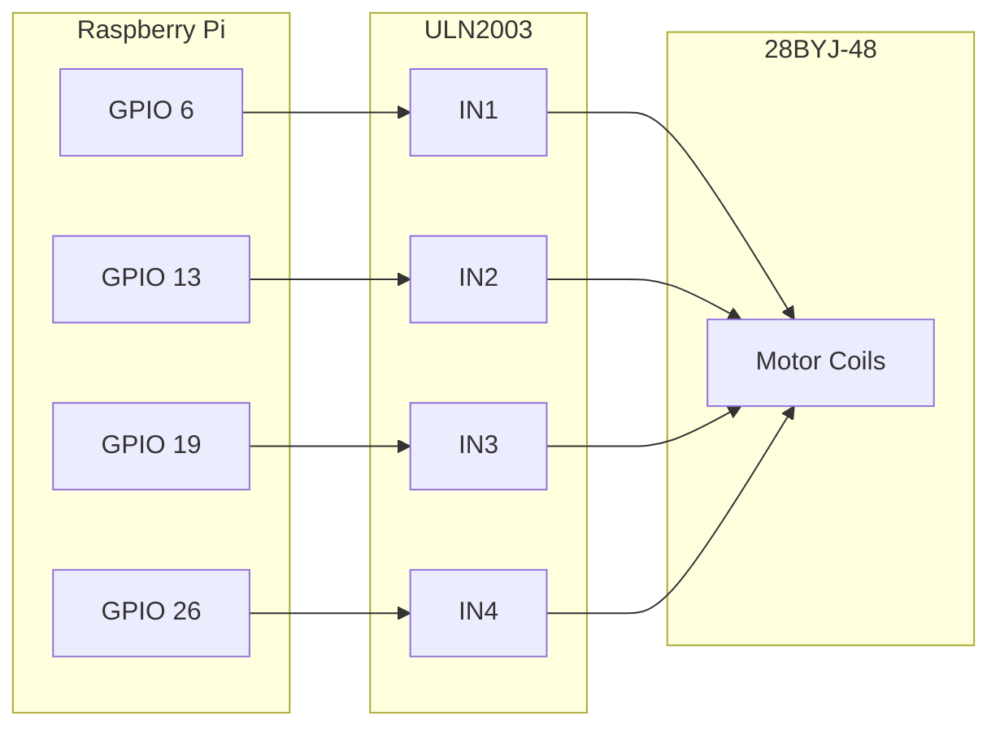

# Interfaces

<!-- metadata:type=interfaces, audience=ai-agents, scope=api -->

## Public API

The module exposes a minimal procedural API. There are no classes, protocols, or abstract interfaces.

```mermaid
graph TD
    subgraph "Public API"
        L[left&#40;step&#41;]
        R[right&#40;step&#41;]
        T[test&#40;move_right=512, move_left=512&#41;]
    end
    subgraph "Internal"
        S1[Step1-Step8]
    end
    L --> S1
    R --> S1
    T --> L
    T --> R
```



## Function Signatures

### `left(step)`

Rotates the motor counter-clockwise (left).

| Parameter | Type | Description |
|-----------|------|-------------|
| `step` | int | Number of full step cycles (512 = 360°) |

**Returns:** None  
**Side effects:** GPIO pin toggling, prints step count to stdout, blocking sleep

### `right(step)`

Rotates the motor clockwise (right).

| Parameter | Type | Description |
|-----------|------|-------------|
| `step` | int | Number of full step cycles (512 = 360°) |

**Returns:** None  
**Side effects:** GPIO pin toggling, prints step count to stdout, blocking sleep

### `test(move_right=512, move_left=512)`

Demonstration function that performs a full rotation in each direction.

| Parameter | Type | Default | Description |
|-----------|------|---------|-------------|
| `move_right` | int | 512 | Steps to rotate right |
| `move_left` | int | 512 | Steps to rotate left |

**Returns:** None  
**Side effects:** Full motor rotation, calls `GPIO.cleanup()` at end

## Hardware Interface

The module communicates with the 28BYJ-48 motor through the ULN2003 driver board via 4 GPIO pins:



## Usage Example

```python
from step_motor_28byj_48 import step_motor_28byj_48

# Rotate 90° clockwise
step_motor_28byj_48.right(128)

# Rotate 180° counter-clockwise
step_motor_28byj_48.left(256)

# Run built-in test (360° each direction)
step_motor_28byj_48.test()
```

## Integration Points

| Integration | Method | Notes |
|-------------|--------|-------|
| RPi.GPIO | Direct function calls | BCM pin numbering, module-level init |
| CLI | `__main__` guard | Running module directly executes `test()` |
| Package import | `from step_motor_28byj_48 import step_motor_28byj_48` | Triggers GPIO init on import |
