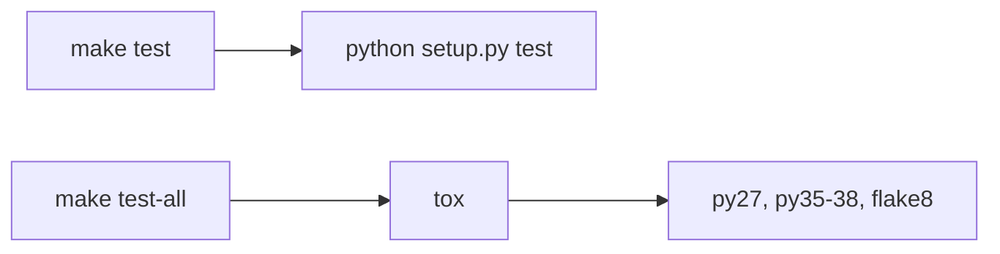
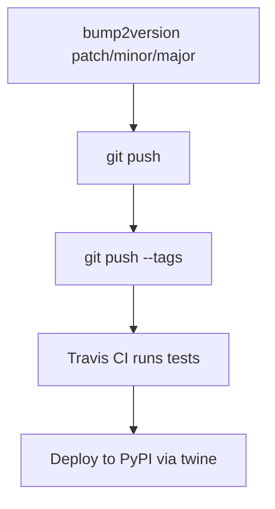

# Workflows

<!-- metadata:type=workflows, audience=ai-agents, scope=processes -->

## Motor Control Workflow

### Left Rotation

```mermaid
flowchart TD
    A[left&#40;step&#41; called] --> B{i < step?}
    B -->|Yes| C[Step1: IN4 HIGH → sleep → LOW]
    C --> D[Step2: IN3,IN4 HIGH → sleep → LOW]
    D --> E[Step3: IN3 HIGH → sleep → LOW]
    E --> F[Step4: IN2,IN3 HIGH → sleep → LOW]
    F --> G[Step5: IN2 HIGH → sleep → LOW]
    G --> H[Step6: IN1,IN2 HIGH → sleep → LOW]
    H --> I[Step7: IN1 HIGH → sleep → LOW]
    I --> J[Step8: IN1,IN4 HIGH → sleep → LOW]
    J --> K[Print progress]
    K --> B
    B -->|No| L[Return]
```

### Right Rotation

```mermaid
flowchart TD
    A[right&#40;step&#41; called] --> B{i < step?}
    B -->|Yes| C[Step8: IN1,IN4 HIGH → sleep → LOW]
    C --> D[Step7: IN1 HIGH → sleep → LOW]
    D --> E[Step6: IN1,IN2 HIGH → sleep → LOW]
    E --> F[Step5: IN2 HIGH → sleep → LOW]
    F --> G[Step4: IN2,IN3 HIGH → sleep → LOW]
    G --> H[Step3: IN3 HIGH → sleep → LOW]
    H --> I[Step2: IN3,IN4 HIGH → sleep → LOW]
    I --> J[Step1: IN4 HIGH → sleep → LOW]
    J --> K[Print progress]
    K --> B
    B -->|No| L[Return]
```

### Test Workflow

```mermaid
flowchart TD
    A[test&#40;&#41; called] --> B[right&#40;512&#41;<br/>360° clockwise]
    B --> C[left&#40;512&#41;<br/>360° counter-clockwise]
    C --> D[GPIO.cleanup&#40;&#41;]
    D --> E[Return]
```

## Development Workflows

### Build & Install

### Testing

### Release

### Documentation

## Module Import Side Effects

```mermaid
flowchart TD
    A[import step_motor_28byj_48] --> B[GPIO.setmode&#40;BCM&#41;]
    B --> C[Define pin constants]
    C --> D[GPIO.setup&#40;pins, OUT&#41;]
    D --> E[GPIO.output&#40;pins, False&#41;]
    E --> F[Module ready for use]
```

**Important:** Importing this module on non-Raspberry Pi hardware will raise a `RuntimeError` from RPi.GPIO because the GPIO hardware is not available.
