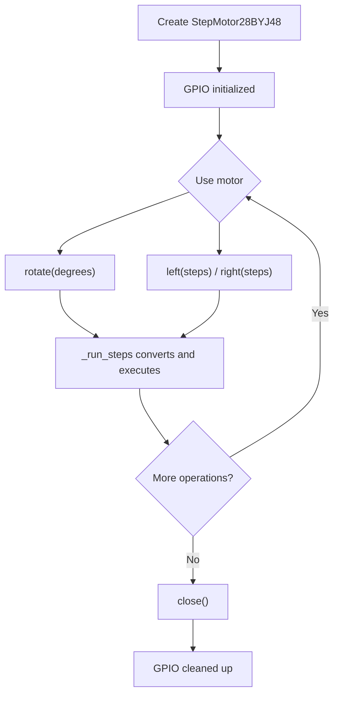
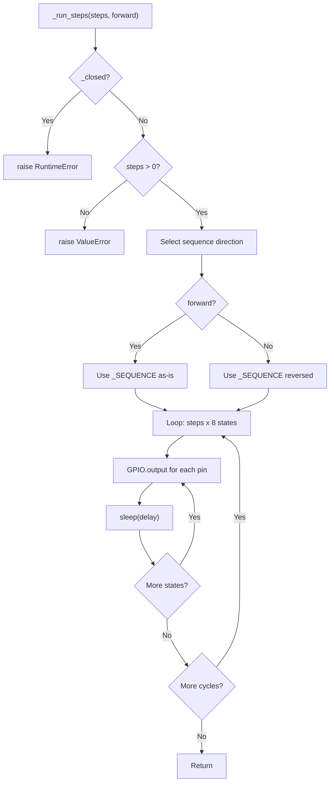
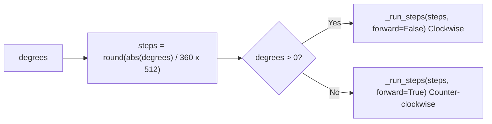
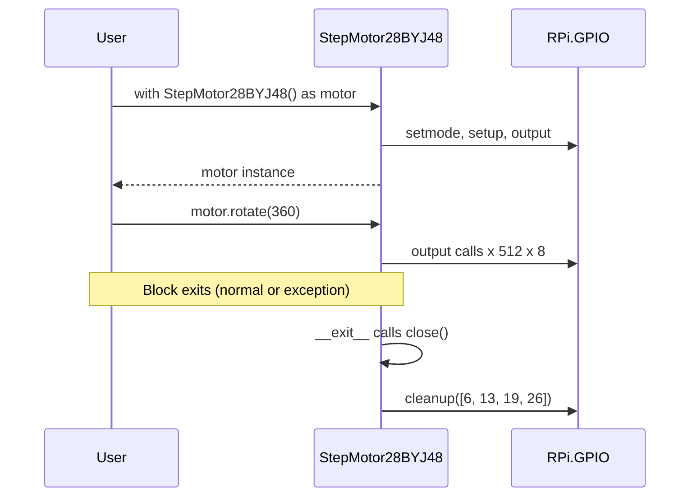
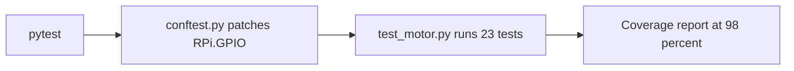
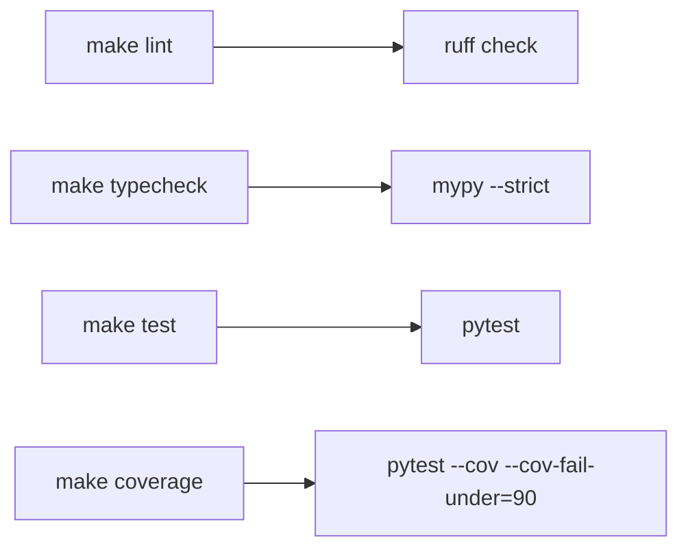
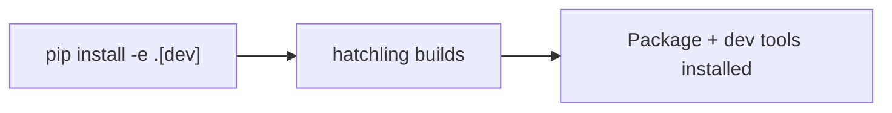

# Workflows

<!-- metadata:type=workflows, audience=ai-agents, scope=processes -->

## Motor Control Workflow

### Typical Usage Flow

### Rotation Execution

### Degree-to-Steps Conversion

## Context Manager Lifecycle

## Development Workflows

### Testing

### Quality Checks

### Build and Install

